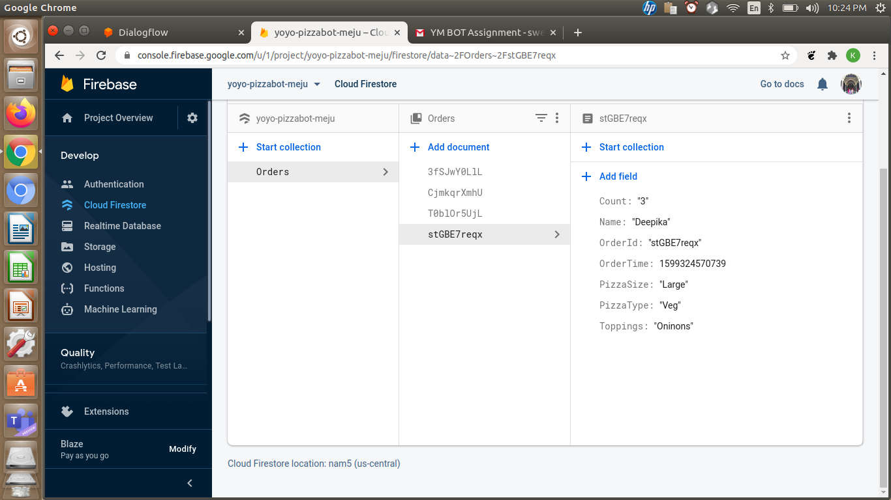

# PizzaOrderChatBot
A chatbot assistant to help you order pizza.
Click [here](https://drive.google.com/file/d/1ZaEKGgEMk70w49x-CJuJbqaUjHDomFi4/view) for demo.  
Database snashopt after making a new order: 
 
Click [here](http://t.me/ThePizaaBot) to access the bot 

### Dialogflow: 
A natural language understanding platform by google. It has been used in this project to aid the natural language processing and conversational features of the chatbot. 

### Firebase
It Google's application development platform to aid build highly scalable and fast applications. It offers two client accessible databases. In this project I have used Firestore, a NoSQL database due its high scalability and querying speed.

### Google Cloud Functions
In order to make the bot to be more dynamically responsive to the user queries and To connect to the project's database, which is Cloud Firestore we need to make fullfillments using Node.js. For the same, we create a project on google cloud which is linked to our chatbot and enable cloud functions. 

### Node.js 
Node.js is a Javascript runtime built on Google's v8 engine. In this project Node.js is used for creating the fullfillments that will be triggered when an certain Intent is called when a user asks a matching query. 

## Functionalities supported by the Bot:
1. Place an order for Pizza with following details: 
  * Customer Name
  * Size of the Pizza (Large, Small, Medium)
  * Type of Pizza (Vegetarian/Non-Vegetarian)
  * Extra Topping choice
  * Number of Pizzas
  
2. Once the customer provides with all the necessary details, the bot places the order, generates a unique order id, stores the customer order details to the backend database. After successful order creation in the backend, the customer is responded with a unique 10 digit order id for to aid him in tracking his order in future.
otatus of an order:
  * The bot is capabale of taking an order id from the customer, searching for the same in the backend orders database and returns one of the two following outputs:
    * If the order has not been placed already, it guides the customer on how to place a new order.
    * If the order has already been placed, it returns the status of the order such as "Order Reached Chef", "Food is being prepared", "Delivery person on his way", "Food delivered". The above is followed by a detailed snapshot of what the requested customer has ordered. 

  

## Instructions to use the bot:

### To place a new order and generate a new order ID (the order is automatically stored in the firestore database for future tracking)

* Please ensure telegram is installed inorder to use the bot. 
* Click on the bot link, and the bot will open up.
*  Initiate the conversation using phrases like "Hey", "Hello", "Hola", "Greetings" etc.
* Once the bot introduces itself and asks how it can help you, you can ask the bot to order a pizza for you by prompting "I want to order a Pizzaa", "I need a pizza" or other phrases alike.
* The bot will ask you for your name before taking the pizza details, respons by carefully typing in your name.
* Once the bot has got your name, it will present you with a menu of sizes available and query you regarding the Size you wish to order. You can choose from available size by either typing out "Large", "small", "Medium" in words, or you can just type "L", "M", "S", or even go with the option numbers from the menu and just type "1", "2", "3".
* Following this, you will be prompted regarding type of Pizza, reply with "Veg", "Vegetarian", "NV", "Non-veg", "Non-Vegetarian" or alike as per your choice.
* As a follow up question, you will be requested to choose your toppings, either type out the name or enter the option number to choose your toppings
* As a final question to complete your order, you will asked the quantity that you would like to order, you can respond with either number or in words about the count.
* After collecting all the details from the user, the bot generates a unique order id, Pushes a new record into the firestore database for the customer and returns with a success message and Order Id for the cutomer to track the order in future. 

### To check the status of an order:
* To check the status of an order, prompt the bot with phrases like "Where is my order", "What happened to my order?", "where is my pizza?" or alike.
* As a response, the bot will ask you for your order id.
* Respond to the bot with the folllwing phrase "It is <your_unique_order_id>". 
* Now the bot will query the backend, and search for your order and respond with either of the two following outcomes:
  * No such order exist, then it guides you on how to place a new order
  * If an order exists, it respons with two major parts:
    * The staus of the order:
      * "Reached the chef", if the order was placed within the last 5 minutes.
      * "Order is being prepared", if the order is more than 5 minutes old but less than 15 minutes old.
      * "Our delivery partner is out for delivery", if the order was placed somewhere between 15-40 minutes ago.
      * "Order delivered", if the order is more than 40 minutes old.
    * The details of the order such as:
      * Customer Name
      * Order ID
      * Order Time
      * Pizza Size
      * Pizza Type
      * Toppings
      * Count

